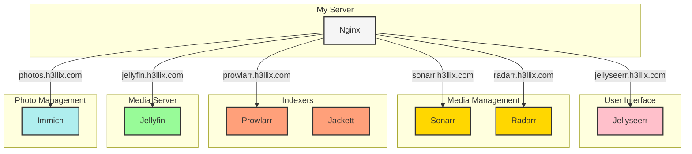

## Introduction 

In this guide, I'll walk you through my setup for a complete home media server environment using Docker containers, Nginx as a reverse proxy, and Tailscale for secure remote access. This configuration allows me to host Jellyfin for media streaming, Sonarr/Radarr for content management, and even Immich for photo management—all accessible via custom domain names from anywhere.



## Components of My Setup

My media server stack includes:

- **Media Management**: Sonarr (TV shows), Radarr (movies), Bazarr (subtitles)
- **Media Discovery**: Prowlarr, Jackett with FlaresolverR for indexer access
- **Download Client**: qBittorrent
- **Media Server**: Jellyfin with NVIDIA GPU acceleration
- **Request System**: Jellyseerr
- **Photo Management**: Immich (with machine learning capabilities)
- **Network**: Tailscale for secure remote access
- **Reverse Proxy**: Nginx for nice domain names
- **VPN**: Cloudflare WARP for accessing region-restricted content

## Hardware Configuration

I'm using a home server with:

- My NTFS harddrive shared between my windows and linux at `/mnt/ntfs/` for media content
- Another wired external drive `(/media/h3llix/Elements)` for photo storage
- NVIDIA GPU for hardware transcoding in Jellyfin

## Setting Up the Environment

### Step 1: Storage Configuration

I mount my external drives using fstab for persistence across reboots:

```bash
# Example fstab entry for media drive
UUID=your-drive-uuid /mnt/ntfs ntfs defaults,nofail 0 0
```

In my case fstab entry looks like following:
```
/dev/sda2 /mnt/ntfs ntfs-3g defaults 0 0
```
### Step 2: Docker Compose Configuration


#### VPN and Network Setup

I use a Cloudflare WARP container for protecting certain services:

```yaml
  vpn:
    image: caomingjun/warp
    container_name: warp
    restart: always
    device_cgroup_rules:
      - 'c 10:200 rwm'
    ports:
      - "1080:1080"
      # Additional ports for services
    cap_add:
      - NET_ADMIN
    # Other VPN configuration
```

#### Photo Management with Immich

```yaml
  immich-server:
    container_name: immich_server
    image: ghcr.io/immich-app/immich-server:${IMMICH_VERSION:-release}
    volumes:
      - ${UPLOAD_LOCATION}:/usr/src/app/upload
      - /etc/localtime:/etc/localtime:ro
    env_file:
      - .env
    ports:
      - '2283:2283'
    # Other configurations
```

### Step 3: Nginx Configuration

I use Nginx as a reverse proxy to make each service accessible via a friendly subdomain:

```nginx
# Jellyfin server
server {
    listen 80;
    server_name netflix.h3llix.com;
    
    location / {
        proxy_pass http://localhost:8096/;
        proxy_set_header Host $host;
        # Other proxy headers
        
        # WebSocket support
        proxy_http_version 1.1;
        proxy_set_header Upgrade $http_upgrade;
        proxy_set_header Connection "upgrade";
        
        # Large file support
        proxy_buffering off;
    }
}
```

Similar configurations exist for all other services, giving me access to:

- netflix.h3llix.com (Jellyfin)
- sonarr.h3llix.com
- radarr.h3llix.com
- torrent.h3llix.com (qBittorrent)
- photos.h3llix.com (Immich)
- And more!

### Step 4: Tailscale for Secure Access

Tailscale provides a secure network overlay that allows me to access my services from anywhere without exposing ports to the internet:

1. Install Tailscale on your server:
    
    ```bash
    curl -fsSL https://tailscale.com/install.sh | sh
    ```
    
2. Connect your server to your Tailscale network:
    
    ```bash
    sudo tailscale up
    ```
    
3. Configure DNS in the Tailscale admin console to point your custom domains to your server's Tailscale IP
    

## Workflow: How Everything Works Together

1. **Content Discovery**:
    
    - Users browse available content in Jellyfin or request new content through Jellyseerr
    - Jellyseerr sends requests to Sonarr (TV) or Radarr (movies)
2. **Content Acquisition**:
    
    - Sonarr/Radarr use Prowlarr and Jackett to search for content
    - FlaresolverR helps bypass Cloudflare protection on indexers
    - qBittorrent handles the downloads
    - Bazarr automatically fetches subtitles
3. **Media Organization**:
    
    - Downloaded content is automatically organized in the correct folders
    - Jellyfin scans for new content and makes it available for streaming
4. **Remote Access**:
    
    - Tailscale provides secure access to all services
    - Nginx routes requests to the correct service based on the subdomain
    - Some services (Jellyfin, Prowlarr) route through the WARP VPN for additional protection

## Challenges and Solutions


## Future Enhancements

- Add Prometheus and Grafana for monitoring
- Implement automated backups of configuration files
- Expand photo management capabilities with additional Immich plugins

---

## TODO 

- Add prometheus and grafana metrics for monitoring
-  Back configs for these apps.
-  Complete setup steps for my environment
## Credits 
https://github.com/Morzomb/All-jellyfin-media-server
https://immich.app/docs/install/docker-compose/
